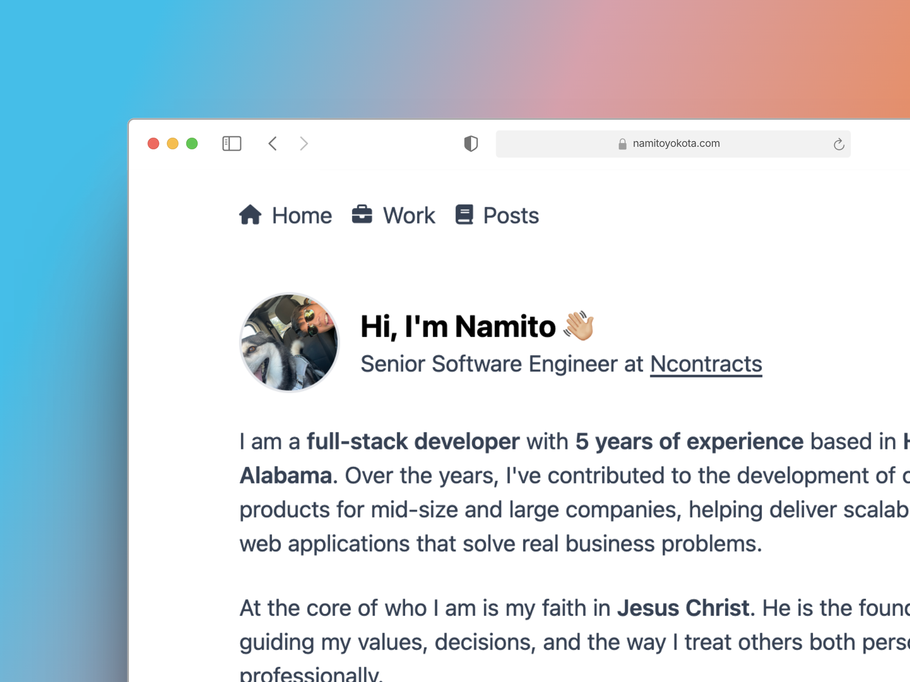

# namitoyokota.com

- **Build Tool**: [Vite](https://vite.dev/)
- **Library**: [React](https://react.dev/)
- **Router**: [React Router](https://reactrouter.com/)
- **CSS Framework**: [Tailwind](https://tailwindcss.com/)
- **Animation Library**: [Motion](https://motion.dev/)
- **Icon Library**: [Font Awesome](https://fontawesome.com/)
- **Data Fetching**: [React Query](https://tanstack.com/query)
- **Clean Code**: [ESlint](https://eslint.org/), [Prettier](https://prettier.io/), [Husky](https://typicode.github.io/husky/)
- **Host** [Vercel](https://vercel.com)

## Site quality


## File structure

```sh
src
|
+-- assets        # static files that are dynamically imported
+-- components    # shared components used across the entire application
+-- layouts       # route and page layout configuration
|
+-- modules       # feature based modules
|   |
|   +-- home      # contains code only used by the home page
|   +-- posts     # contains code only used by the posts page
|   +-- work      # contains cost only used by the work page
|
+-- styles        # tailwind import and global styles
```

## Running locally

```sh
$ git clone https://github.com/namitoyokota/portfolio.git
$ cd portfolio
$ npm install
$ npm run dev
```
